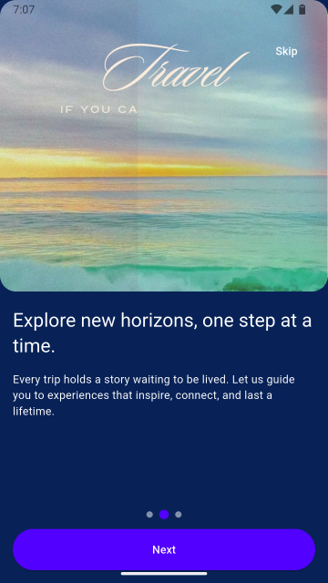
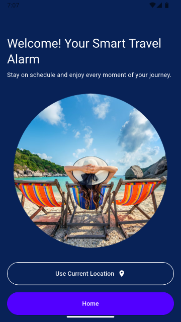
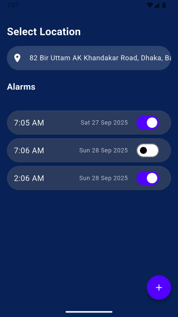

# OnboardX

OnboardX is a sleek, cross-platform mobile experience built with Flutter that demonstrates a polished and interactive onboarding flow. It features smooth animations, a location-aware welcome screen that personalizes the user experience, and integrated alarm scheduling powered by local notifications. Designed with a focus on clean UI and usability, this project highlights how modern mobile apps can combine engaging design with practical functionality, making it a great example of building intuitive user journeys using Flutter.

## Project setup

1. **Prerequisites**
   - Flutter SDK 3.8 or newer (`flutter doctor` should report green across your target platforms).
   - Dart 3.8.
   - Platform-specific tooling (Android Studio/Xcode/Visual Studio) depending on where you plan to run the app.
2. **Clone the repository**
   ```powershell
   git clone [<repo-url>](https://github.com/TheMustafiz10/OnboardX.git)
   cd OnboardX
   ```
3. **Install dependencies**
   ```powershell
   flutter pub get
   ```
4. **Run quality checks (optional but recommended)**
   ```powershell
   flutter analyze
   ```
5. **Launch the app** on your preferred device or emulator:
   ```powershell
   flutter run
   ```

## Tools & packages

- **Flutter** – UI toolkit powering the multi-platform experience.
- **Dart** – Primary programming language for the project.
- **GetX (`get`)** – Dependency injection, routing, and reactive state management.
- **video_player** – Plays the looping onboarding background videos.
- **geolocator** & **geocoding** – Retrieve the device position and convert it to a readable address.
- **permission_handler** – Request runtime permissions (location, notifications, exact alarms).
- **flutter_local_notifications** & **timezone** – Schedule precise alarms with timezone awareness.
- **intl** – Format dates and times for the alarm list.
- **flutter_lints** – Static analysis rules that keep the codebase tidy.

## Architecture

The app now follows a feature-first structure with shared building blocks:

```
lib/
├── common_widgets/     # Reusable UI components (e.g. onboarding page)
├── constants/          # App-wide colours, strings, and route names
├── features/           # Feature modules grouped by domain
│   ├── home/           # Alarm management UI + controller
│   ├── onboarding/     # Onboarding pages, controller, and binding
│   └── welcome/        # Welcome screen flow and binding
├── helpers/            # Cross-cutting helpers (routing, location, notifications)
└── main.dart           # App bootstrap using GetMaterialApp
```

## State Management

The project uses **GetX** for:

- Lightweight dependency injection via feature-specific bindings
- Reactive controllers (`GetxController`, `Rx` primitives)
- Named route navigation with transition helpers

## Screenshots

The UI is fully responsive across mobile and desktop. Replace the placeholders below with project screenshots as you capture them:






